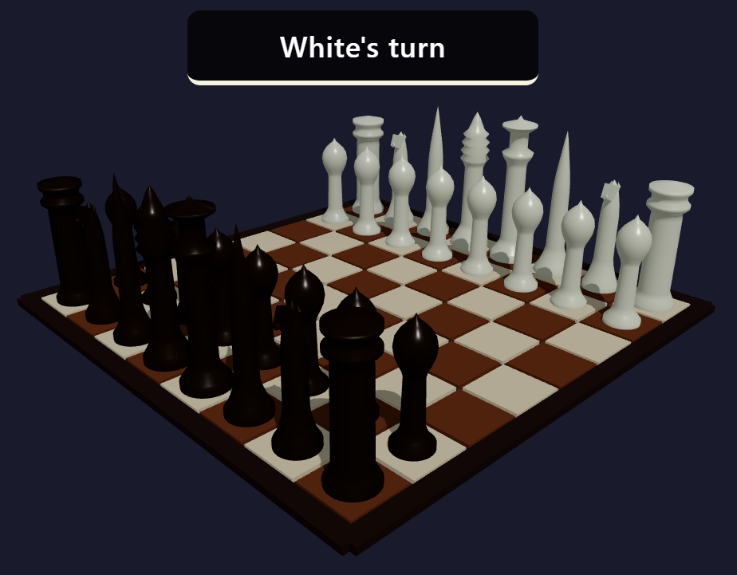
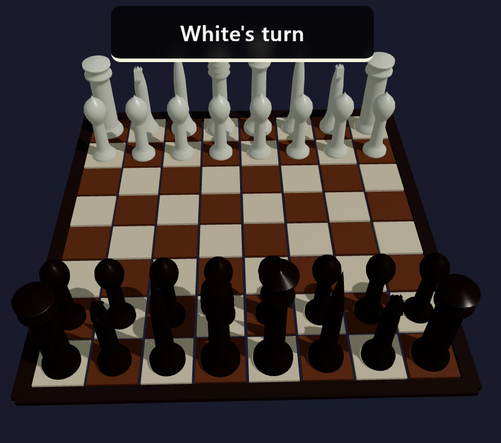

# 3D Chess

<p align="center">
  <a href="./LICENSE"></a>
  <a href="https://vitejs.dev/"></a>
  <a href="https://threejs.org/"></a>
  
  
  
  
</p>

**Author:** [ChandlerIdeaCreator](https://github.com/ChandlerIdeaCreator) — Northeastern University (NEU / 东北大学)

A browser-based **3D chess** experience built with **Three.js** and **Vite**. It features a minimalist board, stylized piece models, soft lighting with cast shadows, and a lightweight HUD for game state (including turn tracking).

<p align="center">
  
  &nbsp;&nbsp;
  
</p>

> **AI-assisted development (important):**  
> The codebase for this project was **co-authored using [Claude Code](https://www.anthropic.com/claude-code)** together with **DeepSeek-V4-Pro**.  
> Human direction, review, and integration decisions shaped the architecture and gameplay; the AI pair-programming workflow was used extensively for implementation, refactors, and iteration speed.

---

## Features

- **Full 3D rendering** with a thick board, stylized pieces, and readable materials
- **Standard chess rules** with move validation, game status, and interactive play
- **Turn indicator** and supporting UI for captures and promotion flows
- **Modern dev stack**: native ES modules, fast local dev server, production build to `dist/`

## Tech Stack

| Area        | Choice                          |
| ----------- | ------------------------------- |
| Runtime     | Modern browsers (ES modules)    |
| 3D          | [Three.js](https://threejs.org/) |
| Tooling     | [Vite](https://vitejs.dev/)      |

## Requirements

- **Node.js** 18+ (recommended: current LTS)

## Getting Started

```bash
git clone <your-repo-url>
cd <cloned-repository-folder>
npm install
npm run dev
```

The dev server defaults to **port 3000** and may open your browser automatically (see `vite.config.js`).

### Scripts

| Command        | Description                |
| -------------- | -------------------------- |
| `npm run dev`  | Start Vite dev server      |
| `npm run build`| Production build → `dist/` |
| `npm run preview` | Preview the production build locally |

## Project Layout (high level)

```
src/
  core/          # Game orchestration
  engine/        # Rules, pieces, validation, status
  renderer/      # Board, pieces, lighting, interaction
  ui/            # Status bar, dialogs, styles
```

## Contributing

Issues and pull requests are welcome. Please keep changes focused and match existing code style.

## License

This project is licensed under the **MIT License** — see [`LICENSE`](./LICENSE).
